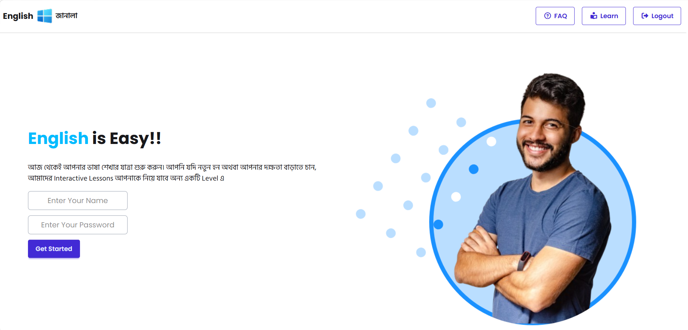
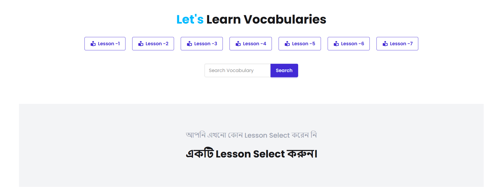
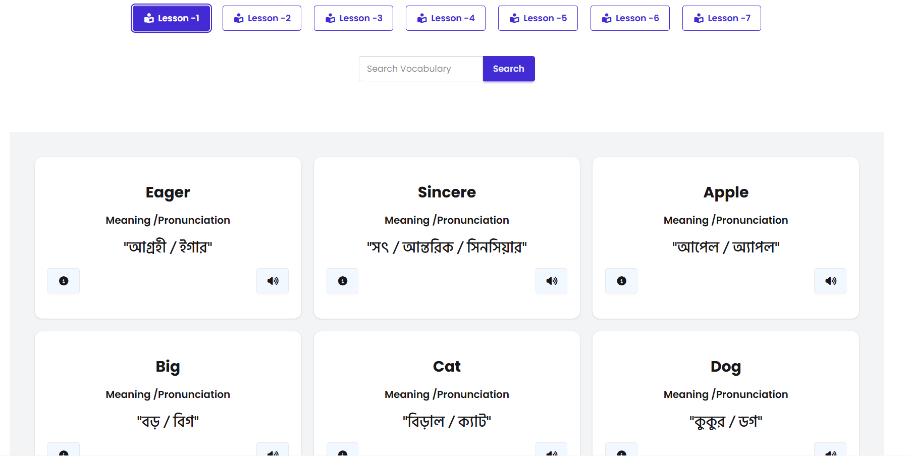
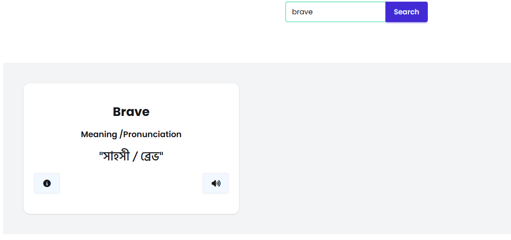
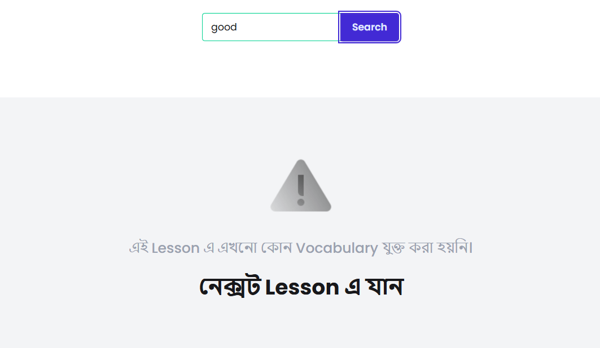

# 📚 English Janala

An interactive English vocabulary learning platform designed to help users expand their vocabulary through word meanings, pronunciations, examples, and language lessons. The application provides a clean, responsive, and user-friendly interface for an engaging learning experience.

## 🌐 Live Demo

🔗 **Live Site:** [[click here ]](https://md-mridul-ali.github.io/english-janala/)

## 📸 Screenshots

### Hero Section



### Home Section



### Vocabulary Section



### Search Result



### Invalid Search



---

## ✨ Features

* 📖 Browse and learn English vocabulary words
* 🔍 Search words instantly
* 📝 View word meanings and examples
* 🔊 Pronunciation support
* ⚡ Dynamic data fetching using Fetch API
* 🔄 Asynchronous operations with Async/Await
* 📱 Fully Responsive Design
* 🎨 Modern UI built with Tailwind CSS and DaisyUI
* 🚀 Fast and lightweight user experience

---

## 🛠️ Technologies Used

### Frontend

* HTML5
* CSS3
* JavaScript (ES6)

### Styling

* Tailwind CSS
* DaisyUI

### Data Handling

* Fetch API
* Async/Await

---

## 📂 Project Structure

```bash
ENGLISH-JANALA
│
├── assets/
│   ├── alert-error.png
│   ├── fa-arrow-right-from-bracket.png
│   ├── fa-book-open.png
│   ├── fa-circle-question.png
│   ├── fb-thumb.png
│   ├── github-thumb.png
│   ├── hero-student.png
│   ├── instagram-thumb.png
│   ├── logo.png
│   └── youtube-thumb.png
│
├── screenshots/
│   ├── hero-section.png
│   ├── home-section.png
│   ├── vocabulary-section.png
│   ├── search-result.png
│   └── invalid-search.png
│
├── scripts/
│   └── script.js
│
├── styles/
│   └── style.css
│
├── index.html
├── README.md
└── tailwind.config.js
```

---

## ⚙️ Installation & Setup

### Clone the Repository

```bash
git clone https://github.com/md-mridul-ali/english-janala.git
```

### Navigate to the Project Folder

```bash
cd english-janala
```

### Open the Project

Simply open the `index.html` file in your browser or use a live server extension.

---

## 🎯 Learning Objectives

This project was built to practice and improve skills in:

* JavaScript ES6 Features
* Fetch API
* Async/Await
* DOM Manipulation
* Responsive Web Design
* Tailwind CSS
* DaisyUI Components

---

## 📱 Responsive Design

The application is fully responsive and optimized for:

* 💻 Desktop Devices
* 📱 Mobile Devices
* 📟 Tablets

---

## 🤝 Contributing

Contributions, suggestions, and improvements are welcome.

1. Fork the repository
2. Create a feature branch
3. Commit your changes
4. Push to your branch
5. Open a Pull Request

---

## 👨‍💻 Author

### MD. Mridul Ali

* GitHub: https://github.com/md-mridul-ali
* LinkedIn: https://www.linkedin.com/in/md-mridul-ali-/

---

## ⭐ Support

If you found this project helpful, please consider giving it a ⭐ on GitHub.

Your support motivates further development and improvements.
